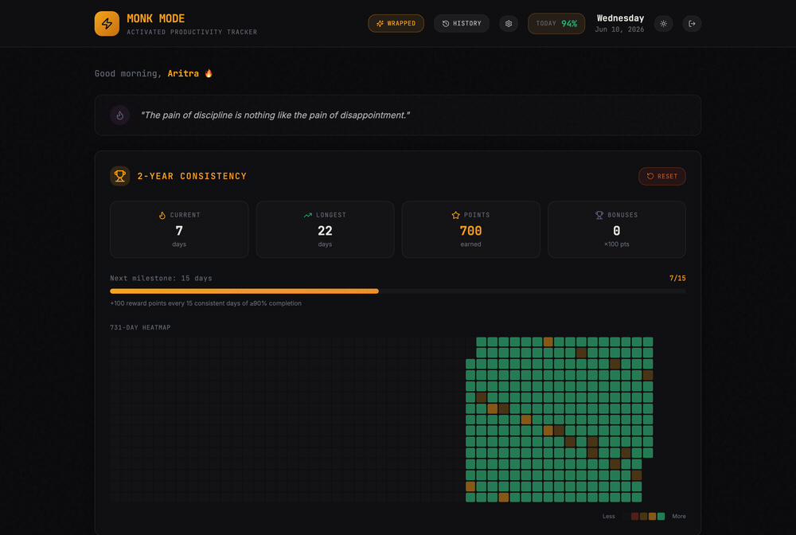
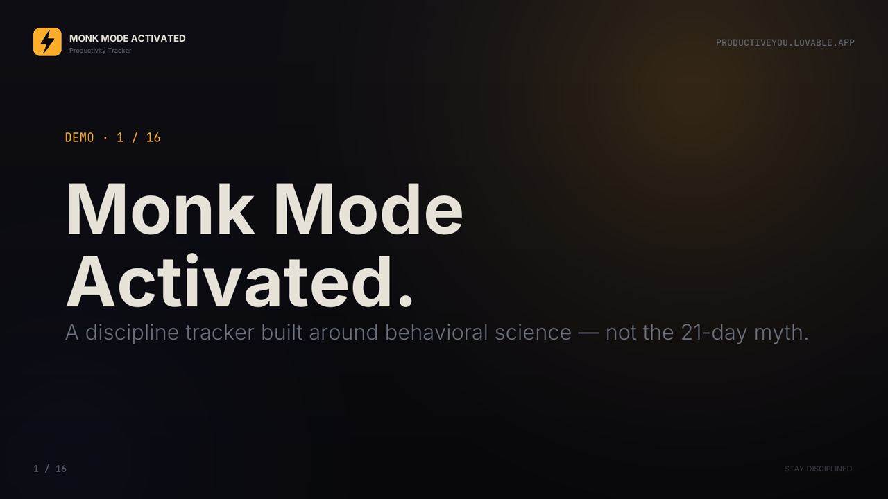
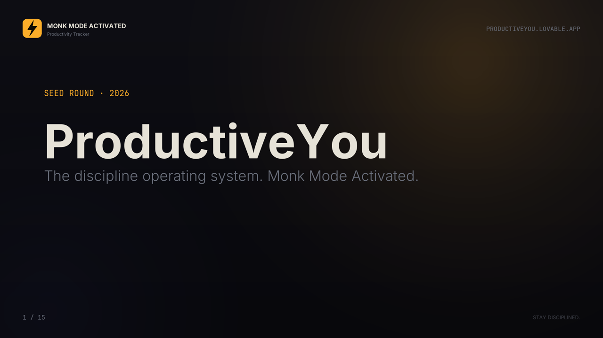
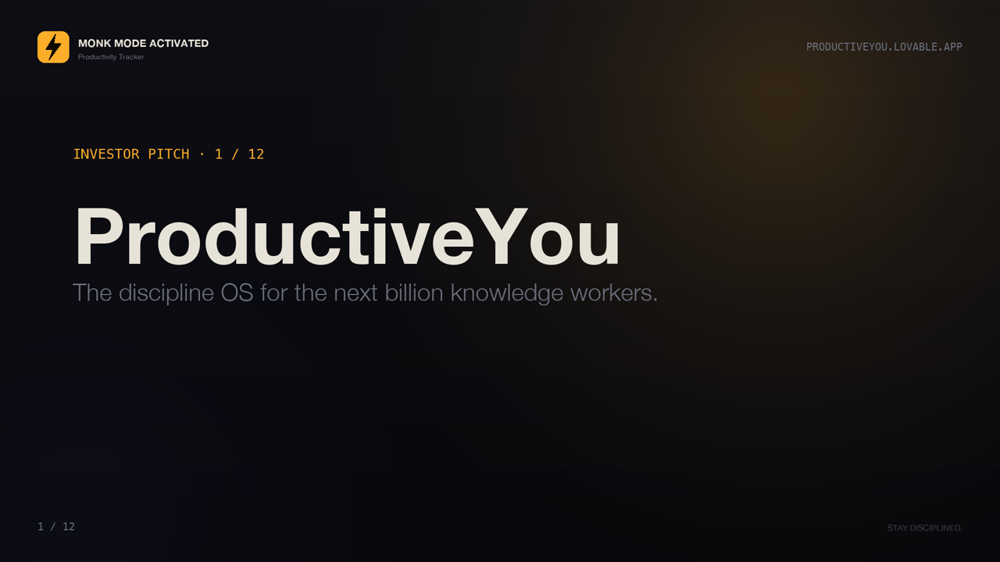

# Monk Mode Activated — Productivity Tracker

> Stay disciplined. Track habits, hold yourself to non-negotiables, journal daily, and build a multi-year consistency streak.

A minimalist, dark-themed productivity tracker built with React + Vite + Supabase and shipped via [Lovable](https://lovable.dev). Comes with a companion Chrome extension for at-a-glance progress on every new tab.

---

## Tech stack at a glance

**Frontend**
&nbsp;


**UI**
&nbsp;


**Backend & data**
&nbsp;


**Quality & build**
&nbsp;


**Ships as**
&nbsp;


---

## See it in 15 seconds

A quick, no-signup look at the whole product — the dashboard, the 2-year streak grid, non-negotiables, daily habits, collectibles, multi-modal journal, history, and the Spotify-style Wrapped recap (in both dark and light themes).



> Prefer the real thing? Jump to the [live app](#live-links) below — it's free and installs on any device.

---

## Try the demo (no signup)

Want to explore before committing to anything? The live app ships with a one-click **demo mode** that loads a fully-populated account — a ~248-day streak, journal entries, daily todos, unlocked collectibles, and a Wrapped recap — so you can tour every feature in seconds. It runs entirely in your browser: **nothing is saved and it never touches real user data.**

Two ways in, both on the **[sign-in page](https://productiveyou.lovable.app/auth)**:

| Option | How |
| --- | --- |
| **One click** | Tap **“Explore the live demo — no signup”** — you land straight on the dashboard. |
| **Demo credentials** | Sign in with **Email:** `demo@productiveyou.app` · **Password:** `monkmode` |

Once inside, a **Demo mode** banner sits at the top of the dashboard; click **Exit demo** there whenever you want to leave and create your own account.

---

## The story — why this exists

I didn't set out to build a product. I set out to fix my own day.

For a long stretch I was the person who *knew* exactly what to do — wake early, move my body, do the deep work first, stay off the feed, write something down before sleep — and still watched the days slip by half-lived. Not because I lacked the plan, but because nothing held the plan in front of me. The intentions lived in my head; my head is a leaky bucket. So I built a small, ugly tracker for an audience of one: **me.** A place to declare my non-negotiables out loud, check off the habits I was trying to become, and write a single honest line at the end of each day. It was scaffolding for a life I kept *almost* living.

The thing that made it stick wasn't gamification. It was the **Zeigarnik effect** — the well-documented finding that the brain holds onto *unfinished* tasks far more insistently than completed ones. An open loop nags. A closed loop releases. Most productivity apps weaponise this badly: they leave you staring at a wall of red, every missed day an open wound that never closes, until the guilt itself becomes the reason you quit. I wanted the opposite. I wanted a tool that uses the Zeigarnik tension *for* me — surfacing the one open loop that matters today, letting me close it, and then *letting it go* — instead of hoarding my failures into a streak I'm terrified to break. Close the loop, feel the release, show up again tomorrow. That tiny, repeatable hit of *completion* is the whole engine.

Once my own days started compounding, I realised the tool wasn't really about productivity. It was about **becoming someone over a long enough horizon that the change is undeniable.** That's when "my app" became **Monk Mode Activated**.

---

## What it actually is — product intent

> **Monk Mode Activated is a 2-year discipline operating system that turns daily consistency into a visible identity — without the streak shame that kills every other habit app.**

Everyone else sells a sprint. We sell the **arc.** The behavioural-science literature is unambiguous: real habit formation takes a *median of 66 days, ranging 18–254* (Lally et al., UCL, 2010) — not the 21-day myth that every competitor quietly optimises for. So the product is built around three convictions:

- **Discipline is an identity, not a streak.** A 730-day default horizon reframes a missed Tuesday from "I failed" to "I'm 312 days into a two-year arc." Perspective is the feature.
- **Forgiveness is a retention strategy.** Missed days are *logged, never punished.* The Zeigarnik loop closes gently — the streak survives, and so does the user.
- **What you refuse to do matters as much as what you do.** Non-negotiables sit *above* habits — the hard floor elite performers actually operate from.

The wedge is simple: in a market where every product is racing to optimise the *wrong number* (21 days), we own the only number the research supports (66+), and we frame it inside the horizon that actually changes a life (2 years).

## Who it's for — market fit & personas

This lives at the intersection of two fast-growing markets — **productivity apps** ($14.5B → $30.9B by 2034) and **mental-health / behaviour-change apps** ($8.6B → $35.3B by 2034). We're not a to-do list and we're not a meditation app; we're the disciplined spine between them. The people who feel that gap most:

| Persona | Who they are | The pain we close | What hooks them |
| --- | --- | --- | --- |
| **The Self-Optimiser** | 22–35, reads atomic-habits-adjacent content, has tried (and churned out of) five habit apps | Every app shamed them into quitting after one missed day | Forgiving streak + the 2-year identity arc |
| **The Quiet Rebuilder** | Coming out of burnout, breakup, or a rough year; wants to *become someone* again | Tools feel either clinical (therapy apps) or hollow (gamified streaks) | Daily journal + non-negotiables as a private hard floor |
| **The Deep Worker** | Founder, creator, grad student, athlete — performance is their living | Willpower dies in the browser; the new tab is a doomscroll launchpad | Chrome extension turns every new tab into a discipline checkpoint |
| **The Reflective Finisher** | Loves the year-in-review moment, screenshots their Spotify Wrapped | No reflection layer that compounds learning over time | **Wrapped** — a Spotify-style year-end recap of their discipline |

The common thread: people who don't need *more* tasks — they need a system that keeps the *right* loops open just long enough to close them, and a horizon long enough to make the change undeniable.

## How we show up — brand & positioning

**Monk Mode Activated** is deliberately monastic: a dark, quiet, distraction-free room for the version of you that's done negotiating. The brand voice is calm, direct, and a little stern — a coach who *forgives* the missed day but never lets you forget the arc. No confetti, no guilt, no streak-anxiety. Just a hard floor, an open loop worth closing today, and a two-year line you're walking down on purpose.

That's the positioning in one line: **not a habit tracker you'll abandon in two weeks — a discipline OS you'll still be running in two years.**

---

## Live links

| What | URL |
| --- | --- |
| **Production app** | https://productiveyou.lovable.app |
| **Preview build** | https://preview--productiveyou.lovable.app |
| **Lovable editor** | https://lovable.dev/projects/a21fcc10-3f98-4280-840a-6903d9629a14 |
| **GitHub repo** | https://github.com/aritrade/productiveyou |

> Open the production link above to start using the tracker.
>
> **New here?** Try the **[demo account](#try-the-demo-no-signup)** for an instant, no-signup walkthrough with sample data.

---

## Get the app — install on any device

The app is a Progressive Web App **plus** a sideloadable Android `.apk`. You can install it on **iPhone, Android, Mac, Windows, Linux, or ChromeOS** with no app store and no developer account — and the prebuilt Android package is right in the repo:

> **» [Download `monk-mode-activated.apk`](./marketing/downloads/monk-mode-activated.apk) (1.5 MB)** — signed Trusted Web Activity, sideload-ready

| Device | Path | Time | Cost |
| --- | --- | --- | --- |
| **Android phone / tablet** | Download the [APK](./marketing/downloads/monk-mode-activated.apk) above » open » **Install** | 30 s | Free |
| **Android (no download)** | Chrome » menu » **Install app** | 10 s | Free |
| **iPhone / iPad** | Safari » Share » **Add to Home Screen** | 10 s | Free |
| **macOS / Windows / Linux** | Chrome / Edge / Brave URL bar » install icon | 5 s | Free |
| **Any desktop browser** | Just visit [productiveyou.lovable.app](https://productiveyou.lovable.app) | 0 s | Free |
| **Chrome extension** | [Load unpacked](./chrome-extension) or grab [`monk-mode-chrome-extension.zip`](./marketing/downloads/monk-mode-chrome-extension.zip) | 30 s | Free |

### iPhone & iPad (free, no Apple Developer Program)

1. Open **Safari** (must be Safari — Chrome on iOS can't install PWAs) and go to **https://productiveyou.lovable.app**.
2. Sign in so your data syncs.
3. Tap the **Share** icon (square with up-arrow) at the bottom.
4. Scroll and tap **Add to Home Screen** » **Add**.
5. The ⚡ Monk Mode icon appears on your home screen. Launching it runs the app **full-screen, standalone, with the iOS status bar styled to match** — indistinguishable from a native app for daily use.

What you get on iOS: full-screen launch, custom icon, splash screen, offline app-shell, persistent local state. What you don't get on iOS (Apple platform limits, not ours): native push notifications when the app is closed, background sync, App Store discovery. A real `.ipa` distributed outside TestFlight needs the [$99/yr Apple Developer Program](https://developer.apple.com/programs/) — see the [iOS native app section](#ios-native-app-honest-options) below if you want to go that route.

### Android phone & tablet (free, no Play Store)

**Option A — sideload the prebuilt APK _(easiest, recommended)_**

1. **Download** [`marketing/downloads/monk-mode-activated.apk`](./marketing/downloads/monk-mode-activated.apk) (1.5 MB, release-signed Trusted Web Activity).
2. Get it onto your phone — AirDrop to a friend's Android, email it to yourself, Google Drive, USB transfer, anything.
3. On the phone, open the `.apk` from your file manager. First time Android may prompt **Settings » Apps » Special access » Install unknown apps** — grant permission for your file manager (or Chrome, Files, Drive — whichever opened the .apk).
4. Tap **Install** » **Open**.
5. The ⚡ Monk Mode icon now lives in your app drawer. Launching it opens the full Lovable web app in a Chrome Custom Tab; you'll see a Chrome version banner the very first time, never again.

The APK is a Trusted Web Activity — basically a thin Android wrapper that loads `https://productiveyou.lovable.app` full-screen, with the same Supabase auth + offline app-shell behaviour as the PWA. Sign-in, journal, photo uploads, everything works identically to the website. Note the URL bar will be hidden once Lovable redeploys the `/.well-known/assetlinks.json` we shipped (see [Trusted Web Activity verification](#trusted-web-activity-verification) below).

**Option B — install the PWA straight from Chrome (no APK)**

1. Open **Chrome** on Android and go to **https://productiveyou.lovable.app**.
2. Tap the **⋮ menu** » **Install app** (or "Add to home screen" on older Chrome versions).
3. Confirm. The icon shows up in your app drawer, full-screen, with splash + offline app-shell support.

**Option C — rebuild the APK yourself**

```bash
# Prereqs: Node 18+, Java JDK 17, Android cmdline-tools, @bubblewrap/cli installed globally
export JAVA_HOME=...                   # e.g. ~/.local/jdk/jdk-17.0.19+10 on macOS
export ANDROID_HOME=...                # Android SDK root
export BUBBLEWRAP_KEYSTORE_PASSWORD=... # set yours (or reuse the existing keystore)
export BUBBLEWRAP_KEY_PASSWORD=...
export KEYSTORE_PATH=...               # optional: reuse an existing keystore to preserve the app's signing identity
./marketing/scripts/build-apk.sh
# » produces marketing/downloads/monk-mode-activated.apk
```

First run downloads ~700 MB (Gradle + AndroidX deps), subsequent runs ~30 s. The script is fully non-interactive — see the file header for the full env-var spec.

### Trusted Web Activity verification

The committed APK is signed with package ID `app.productiveyou.twa`. The matching Digital Asset Link sits at [`public/.well-known/assetlinks.json`](./public/.well-known/assetlinks.json). Once Lovable redeploys, the file is served at `https://productiveyou.lovable.app/.well-known/assetlinks.json` and Chrome verifies the TWA on first launch — at which point the URL bar disappears and the app runs in proper full-screen "trusted" mode. **No additional config needed on your end.** If you ever rebuild with a new signing key, regenerate the fingerprint with:

```bash
keytool -list -v -keystore <your.keystore> -alias android -storepass <pw> | grep SHA256
```

…and replace the value in `public/.well-known/assetlinks.json`.

### macOS, Windows, Linux, ChromeOS desktop

1. Open https://productiveyou.lovable.app in Chrome, Edge, Brave, or Arc.
2. The address bar shows an **install icon** (⊕ on Chrome, similar on others). Click it.
3. Confirm. The app gets a real Dock / Start Menu / launcher entry, opens in its own window, and works offline.

### Chrome extension

A separate Manifest V3 extension that lives in your toolbar + replaces the new-tab page with a discipline dashboard. Full guide and three install paths (one-zip, from-repo, package-it-yourself) live in [**`chrome-extension/README.md`**](./chrome-extension/README.md). Or grab the prebuilt zip directly:

**» [Download `monk-mode-chrome-extension.zip`](./marketing/downloads/monk-mode-chrome-extension.zip) (18 KB)** — unzip » `chrome://extensions` » Developer mode ON » Load unpacked.

### iOS native app — honest options

There is **no free way to ship a real `.ipa`** on the App Store or to sideload one without paying Apple. The cheapest paths:

| Path | What you get | Cost | Notes |
| --- | --- | --- | --- |
| **PWA Add to Home Screen** _(recommended)_ | Indistinguishable from a native app for 95% of users | $0 | What this README covers above |
| **TestFlight** | Up to 10 k beta testers via Apple's portal | $99 / yr (Apple Developer Program) | Requires signing a real `.ipa` |
| **App Store** | Public distribution + push + IAP | $99 / yr (same membership) | App review + monetisation rules apply |
| **AltStore / SideStore** | Free sideload to your own device | Free for user, you must rebuild the `.ipa` every 7 days unless ADP | Requires the user to set up AltServer / WireGuard tunnel |
| **Xcode 7-day free sideload** | Sideload to your personal device | Free | Needs a Mac + Xcode + Apple ID; signing expires every 7 days |

If/when ProductiveYou wants a real iOS native shell, the cleanest path is to wrap the existing PWA with [Capacitor](https://capacitorjs.com/docs/ios) — that's a one-command `npx cap add ios` from the existing build, after which the project opens in Xcode and ships exactly like any other iOS app. The reason this isn't shipped today: an `.ipa` is only useful to users with an Apple Developer Program seat to host it, and the free PWA path covers the same use case for everyone else.

---

## Demo video

A ~3-minute narrated walkthrough of every feature. Click the thumbnail to watch — or [download the MP4 directly](./marketing/demo.mp4).

<p align="center">
  <a href="./marketing/demo.mp4">
    
  </a>
</p>

<p align="center">
  <a href="./marketing/demo.mp4"><b>▶ marketing/demo.mp4</b></a> · ~190s · 1920×1080 · H.264 + AAC · 4.6 MB
</p>

<details>
<summary>What the demo covers (16 slides)</summary>

1. Title — Monk Mode Activated
2. Why this exists — the 21-day myth, why habit apps fail at day 14
3. **Pick Your Non-Negotiables** — fully customizable hard floor per user
4. **Build Your Habit Stack** — fully customizable daily habits per user
5. **Choose Your Horizon** — 1 month / 3 / 6 / 12 / 24 months
6. **Daily Todo & Task Tracker** — auto-resets at midnight IST
7. **Multi-modal Journal** — text, voice, captioned photos
8. **Multi-Year Streak Grid** — visual identity over your full horizon
9. **History + Downloadable PDF Reports** — Summary or Detailed reports by date range
10. **Collectibles** — unlockable badges for milestones (day 7 / 30 / 66 / 100 / 365)
11. **Wrapped** — Spotify-style year-end recap
12. **Light + Dark theme** — smooth animated switch, preference syncs with account
13. **AES-256 encrypted backend** — TLS in transit, row-level security per user
14. **Chrome extension companion** — toolbar popup + new-tab dashboard + smart nudges
15. **66 days behavioral-science backing** — Lally et al., UCL, 2010
16. Outro — start day 1

</details>

<details>
<summary>Inline player (works on GitHub)</summary>

https://github.com/aritrade/productiveyou/raw/main/marketing/demo.mp4

</details>

---

## Why this app exists

Most habit apps treat discipline like a 21-day stunt. They optimise for streak vanity, punish missed days, and lose 90%+ of users within a month. The behavioural-science literature has been clear for over a decade that habit formation takes a **median of 66 days, with a range of 18–254** (Lally et al., UCL, *European Journal of Social Psychology*, 2010 — see [the original paper](https://doi.org/10.1002/ejsp.674) and a recent [interview with Dr Lally](https://www.surrey.ac.uk/news/does-it-really-take-66-days-form-habit-we-asked-expert-dr-pippa-lally)).

**Monk Mode Activated** is built on three premises the research actually supports:

1. **Treat habits as a 2-year arc, not a 21-day stunt.** A long horizon removes the "I've already broken it, give up" trap.
2. **Forgive missed days.** Lally's data shows one missed performance doesn't materially affect habit formation. So our streak survives.
3. **Pair *what you do* with *what you refuse to do*.** Non-negotiables sit above habits — the hard floor that elite performers actually operate from.

### Value proposition

> A 2-year monk-mode operating system that turns daily discipline into a visual identity — without the streak shame that kills every other habit app.

### What it's solving

| Pain | Why it persists | How we solve it |
| --- | --- | --- |
| Habit apps reset progress after one missed day | Built for streak gamification, not behaviour change | Forgiving streak — missed day is logged, never punished |
| Productivity tools demand a setup tax | Designed for power users, not normal humans | Opinionated defaults: 4 non-negotiables, 12 habits, ready in 30 seconds |
| Journaling apps are separate from habit apps | Different funnels in the App Store | One product: habits + journal + todo + Wrapped, synced |
| Willpower dies in the browser | New tab = doomscroll launchpad | Chrome extension converts every new tab into a discipline checkpoint |
| No reflection layer to compound learning | Annual reflection lives in Notion templates | Wrapped — Spotify-style year-end recap of your discipline |

---

## Features (with the tech behind each)

| # | Feature | What it does | Built with |
| --- | --- | --- | --- |
| 1 | **Non-Negotiables** | Custom rules you refuse to break (no smoking, no doomscroll, no skipping workouts). Visible at the top of the day. | React + TypeScript, custom Radix-based [`NonNegotiables`](./src/components/NonNegotiables.tsx) component, persisted to Supabase via [`dailyEntries.ts`](./src/lib/dailyEntries.ts) |
| 2 | **Daily Habits** | Tap-to-check list of habits you're building. Live completion percentage updates on every interaction. | React state + memoization, [`DailyHabits`](./src/components/DailyHabits.tsx) |
| 3 | **Journal — text, voice, photos** | Multi-modal daily journaling with quick text, voice recordings, and captioned photos. | Web Audio API, Supabase Storage for photos and audio, [`JournalSection`](./src/components/JournalSection.tsx) |
| 4 | **Daily Todo** | Lightweight todos that reset at IST midnight via a custom hook. | Custom [`useMidnightReset`](./src/hooks/useMidnightReset.ts), [`TodoList`](./src/components/TodoList.tsx) |
| 5 | **Streak Tracker** | 2-year consistency grid coloured by completion percentage per day. Skipping a day doesn't reset it. | recharts, custom heatmap in [`StreakTracker`](./src/components/StreakTracker.tsx) |
| 6 | **History** | Browse every past day with the same checklist + journal view. | React Router 6, server-state via TanStack Query |
| 7 | **Wrapped** | Year-end recap: best month, longest streak, most-honored habit. Exportable as PDF/image cards. | jsPDF + jspdf-autotable + html2canvas, [`pages/Wrapped.tsx`](./src/pages/Wrapped.tsx) |
| 8 | **Collectibles** | Unlockable badges for streak milestones (7, 30, 66, 100, 365 days). | Local logic + Supabase persistence, [`Collectibles`](./src/components/Collectibles.tsx) |
| 9 | **Daily Quote** | Rotating motivational quote pulled from a curated list. | [`DailyQuote`](./src/components/DailyQuote.tsx) |
| 10 | **Theme (dark / light)** | Animated transition between themes — defaults to dark. | `next-themes`, custom CSS transition for non-jarring switches |
| 11 | **Auth & cloud sync** | Email / OAuth via Supabase. Per-user persistence across devices. | `@supabase/supabase-js`, `@lovable.dev/cloud-auth-js`, [`useAuth`](./src/hooks/useAuth.tsx) |
| 12 | **Onboarding** | Profile setup, custom non-negotiables, streak start date, consistency duration (default 24 months). | react-hook-form + zod, [`pages/Onboarding.tsx`](./src/pages/Onboarding.tsx) |
| 13 | **Chrome extension companion** | Toolbar popup + new-tab dashboard + smart morning / midday / evening nudges. Manifest V3, no permissions beyond `storage`, `alarms`, `notifications`. | Vanilla JS + `chrome.storage.local`, see [`chrome-extension/`](./chrome-extension) |

### Tech stack (high level)

- **Frontend:** Vite, React 18, TypeScript, React Router 6, TanStack Query
- **UI:** Tailwind CSS, shadcn/ui (Radix Primitives), lucide-react, recharts
- **Forms & validation:** react-hook-form + zod
- **Backend:** Supabase (Auth, Postgres, Storage)
- **PDF / export:** jsPDF, jspdf-autotable, html2canvas
- **Notifications & schedules (extension):** Chrome `alarms` + `notifications` APIs
- **Tooling:** ESLint 9, Vitest + Testing Library, jsdom
- **Built with:** [Lovable](https://lovable.dev) (AI-paired builds), commits auto-sync to this repo

---

## Investor pitch deck & marketing video

For anyone evaluating ProductiveYou as an investment, partnership, or hire — start here.

### 15-slide pitch deck

A self-contained PDF covering problem, solution, product, TAM / SAM / SOM, behavioural-science moat, business model, unit economics, why-now, competition, roadmap, team, and the ask.

<p align="center">
  <a href="./marketing/pitch-deck.pdf">
    
  </a>
</p>

<p align="center">
  <a href="./marketing/pitch-deck.pdf"><b>📊 marketing/pitch-deck.pdf</b></a> · 15 pages · 1920×1080 · 1.7 MB
</p>

### 2.5-minute marketing video

A narrated walkthrough designed for VCs, angels, and partner intros. Same content as the deck, scripted as a story.

<p align="center">
  <a href="./marketing/investor-pitch.mp4">
    
  </a>
</p>

<p align="center">
  <a href="./marketing/investor-pitch.mp4"><b>▶ marketing/investor-pitch.mp4</b></a> · ~182s · 1920×1080 · H.264 + AAC · 4.5 MB
</p>

<details>
<summary>Inline player (works on GitHub)</summary>

https://github.com/aritrade/productiveyou/raw/main/marketing/investor-pitch.mp4

</details>

### The numbers in the deck (with sources)

| Topic | Headline | Source |
| --- | --- | --- |
| Productivity apps TAM | $14.5B in 2026 → $30.9B by 2034 (9.9% CAGR) | [Fortune Business Insights](https://www.fortunebusinessinsights.com/productivity-apps-market-110254) |
| Mental health apps TAM | $8.6B in 2026 → $35.3B by 2034 (19.2% CAGR) | [Fortune Business Insights](https://www.fortunebusinessinsights.com/mental-health-apps-market-109012) |
| Digital mental health TAM | $16.3B in 2026 → $58.4B by 2036 (13.6% CAGR) | [Meticulous Research](https://www.meticulousresearch.com/product/digital-mental-health-market-6660) |
| Habit formation | Median 66 days, range 18–254 | [Lally et al., *EJSP*, 2010](https://doi.org/10.1002/ejsp.674) · [interview, 2025](https://www.surrey.ac.uk/news/does-it-really-take-66-days-form-habit-we-asked-expert-dr-pippa-lally) |
| "21-day myth" debunked / 10-week clinical guidance | Origin in 1960s plastic-surgery anecdote, not habit science | [Gardner, Lally & Wardle, *BJGP*, 2012](https://pmc.ncbi.nlm.nih.gov/articles/PMC3505409/) |
| Productivity lost to depression / anxiety | ~$1T per year (global, pre-COVID baseline) | [WHO mental health team](https://www.who.int/teams/mental-health-and-substance-use) |
| % of daily behaviour that is habitual | ~40% | Wood, Quinn & Kashy, *JPSP*, 2002 |

The full citations live in [`marketing/README.md`](./marketing/README.md). The build pipeline is **fully cross-platform (macOS / Linux / Windows)** — bundled OFL fonts, free neural TTS via `edge-tts`, no Mac-only dependencies. Regenerate any artefact in three commands:

```sh
pip install -r marketing/scripts/requirements.txt
python3 marketing/scripts/fetch_fonts.py
python3 marketing/scripts/build_demo.py   # or build_pitch_video.py / build_deck.py
```

### How the unit economics in the deck were modelled

> Note: these are forward projections, not historical traction. They are
> calibrated against public benchmarks from Calm, Headspace, Notion, and
> Streaks. Real numbers will replace these as the product ships paid tiers.

| Lever | Assumption | Why |
| --- | --- | --- |
| Blended ARPU | $42 / yr | 8% paid conversion, 60/40 annual/monthly mix |
| CAC | $9 | Content + referral; Chrome extension lowers paid social need by ~30% |
| Gross margin | ~88% | Supabase + Cloudflare scale linearly with users |
| Payback | <4 months | At $42 ARPU vs. $9 CAC |
| LTV / CAC | ~11x | Assumes 24-month average lifetime |

The deck and pitch video frame the **2-year discipline window** as the wedge: nobody else sells a habit-forming product with a 730-day default horizon, in a market where every competitor is optimising for the wrong number (21 days).

---

## Data & security

### Where your data lives

Everything you create in the app — habits, non-negotiables, journal entries, todos, photos — is persisted to a **Supabase** project ([`supabase/config.toml`](./supabase/config.toml), project ID `amnvyfgibwojeuokiean`). Supabase is a managed Postgres + S3-compatible storage platform running on AWS.

| Data | Where it lives | Schema |
| --- | --- | --- |
| Profile (display name, custom habits/rules, streak start date, onboarding flag, consistency duration) | `public.profiles` (Postgres) | [migration `20260330193220`](./supabase/migrations/20260330193220_ea08bfa1-775c-48dc-bfe6-0692111e3d5a.sql) |
| Daily entries (habit checks, non-negotiable checks, journal text/audio refs, todos, completion %) | `public.daily_entries` (Postgres, JSONB columns) | [migration `20260328110127`](./supabase/migrations/20260328110127_b7c51dd6-f990-46b6-8723-6f50acfe4fc7.sql) |
| Journal photos | `storage.objects` in the **private** `journal-photos` bucket, S3-backed | [migration `20260402143346`](./supabase/migrations/20260402143346_af6722a8-9de9-4f21-8cb3-f7673f8b6979.sql) |
| Auth identities, password hashes, OAuth tokens, refresh tokens | `auth.users` (managed by Supabase Auth) | n/a — Supabase-managed |

The Chrome extension keeps a **separate, local-only** copy in `chrome.storage.local`. It does not sync to Supabase today.

### Encryption in transit

- All app ↔ Supabase traffic is **HTTPS / TLS 1.2+** — `VITE_SUPABASE_URL` is `https://amnvyfgibwojeuokiean.supabase.co`.
- Realtime websockets (TanStack Query subscriptions, Supabase Realtime) go over **WSS** (TLS-encrypted).
- Storage uploads to the private bucket are signed and tunneled over HTTPS.
- Auth flows (email magic links, OAuth callbacks) use HTTPS end-to-end.

Reference: [Supabase Security overview](https://supabase.com/security) — *"All customer data is encrypted at rest with AES-256 and in transit via TLS."*

### Encryption at rest

Supabase encrypts everything on disk by default; it is not user-configurable and cannot be disabled:

| Layer | Algorithm | Scope |
| --- | --- | --- |
| Postgres data files, indexes, WAL | **AES-256** | All `public.*` tables incl. profiles, daily_entries |
| Daily backups + PITR snapshots | **AES-256** | All databases |
| Storage objects (journal photos, future audio) | **AES-256** (SSE) | `journal-photos` bucket, S3-backed |
| Temporary files | **AES-256** | Sort spills, vacuum scratch space |

Reference: [Supabase Data Encryption docs](https://supabase.com/docs/guides/platform/security#encryption).

### Authorization (row-level security)

Every table is protected by **Row Level Security (RLS) policies** enforced inside Postgres, not at the application layer. The browser holds a short-lived JWT issued by Supabase Auth, and every query Supabase runs is scoped to `auth.uid() = user_id`. Concretely, from the migrations:

```sql
-- public.profiles
CREATE POLICY "Users can read own profile" ON public.profiles
  FOR SELECT TO authenticated USING (user_id = auth.uid());

-- public.daily_entries
CREATE POLICY "Users can read own entries" ON public.daily_entries
  FOR SELECT TO authenticated USING (user_id = auth.uid());
CREATE POLICY "Users can insert own entries" ON public.daily_entries
  FOR INSERT TO authenticated WITH CHECK (user_id = auth.uid());
-- + UPDATE, DELETE with the same predicate

-- storage.objects (private journal-photos bucket)
CREATE POLICY "Authenticated users can read own journal photos"
  ON storage.objects FOR SELECT TO authenticated USING (
    bucket_id = 'journal-photos'
    AND (storage.foldername(name))[1] = auth.uid()::text
  );
```

The journal-photos bucket was [explicitly flipped from public to private](./supabase/migrations/20260402143346_af6722a8-9de9-4f21-8cb3-f7673f8b6979.sql) and now requires every read/write to match the user's own UUID prefix in the object path.

### Keys & secrets

| Key | Type | Where it lives | Safe to expose? |
| --- | --- | --- | --- |
| `VITE_SUPABASE_PUBLISHABLE_KEY` | Supabase **anon JWT** | `.env`, bundled into the browser | **Yes** — it carries no admin rights and is gated by RLS |
| `VITE_SUPABASE_URL` | Project endpoint | `.env`, browser bundle | **Yes** — it's a per-project subdomain, not a secret |
| `SUPABASE_SERVICE_ROLE_KEY` | Supabase **service role** (bypasses RLS) | **Never in this repo or the browser** — server-side only | **No** |

If you fork this repo and reuse the bundled `.env`, you are reusing **someone else's Supabase project**. Provision your own at https://supabase.com/dashboard, run the migrations under `supabase/`, and update the three `VITE_*` variables.

### What is **not** end-to-end encrypted

Be honest with users: Supabase (and AWS underneath) can technically read the rows because the encryption keys are platform-managed, not user-held. If true zero-knowledge is on the roadmap, the cleanest path is client-side encryption (e.g. libsodium / WebCrypto) of journal text + photos before upload, with the key derived from the user's password and never sent to Supabase. **Not implemented today** — call it out before pitching this to security-conscious enterprise buyers.

---

## Project structure

```
.
├── chrome-extension/    # Companion MV3 extension (popup + new-tab dashboard)
│   ├── manifest.json    # MV3 manifest, icons + permissions + popup + newtab + worker
│   ├── popup.html / .js
│   ├── newtab.html
│   ├── background.js    # Alarms + notifications + midnight reset
│   └── icons/           # icon16/32/48/128 PNGs + 1024px master
├── marketing/           # Demo + investor videos, pitch-deck PDF, build scripts
│   ├── demo.mp4
│   ├── investor-pitch.mp4
│   ├── pitch-deck.pdf
│   ├── README.md        # How to regenerate everything
│   ├── downloads/
│   │   ├── monk-mode-activated.apk         # 1.5 MB signed Android TWA, ready to sideload
│   │   └── monk-mode-chrome-extension.zip  # 18 KB Chrome extension bundle
│   ├── scripts/         # slidekit + build_demo + build_pitch_video + build_deck + build-apk + scaffold-twa
│   └── thumbnails/      # Cover frames + voiceover manifests
├── public/              # Static assets served as-is at site root
│   ├── manifest.webmanifest  # PWA manifest (iOS + Android + desktop install)
│   ├── sw.js                 # Service worker (offline app-shell, no Supabase caching)
│   ├── icons/                # PWA icons 72/96/128/144/152/192/384/512 + maskable + apple-touch
│   ├── .well-known/
│   │   └── assetlinks.json   # Digital Asset Link verifying the Android TWA → full-screen mode
│   └── favicon.ico
├── src/
│   ├── components/      # Habits, journal, streak, collectibles, UI primitives
│   ├── hooks/           # useAuth, useMidnightReset, etc.
│   ├── integrations/    # Supabase client
│   ├── lib/             # Daily-entry helpers, utils
│   ├── pages/           # Auth, Onboarding, Index, History, Wrapped, NotFound
│   └── main.tsx
├── supabase/            # config.toml + SQL migrations
├── index.html           # PWA meta tags + service-worker registration live here
└── package.json
```

---

## Local development

> **Platform support:** the app, the build pipeline, the APK build, and the marketing-asset build scripts all run on **macOS, Linux, and Windows**. The only Mac-specific thing in the entire repo is an *optional last-resort* fallback voice (`say`) inside the TTS chain — and even that's preceded by two cross-platform options (`edge-tts`, then `pyttsx3`). No part of the project requires a Mac.

You need Node.js 18+ and either `bun` or `npm`. Install with [nvm](https://github.com/nvm-sh/nvm#installing-and-updating) (macOS/Linux) or [nvm-windows](https://github.com/coreybutler/nvm-windows) if you don't have Node.

```sh
git clone https://github.com/aritrade/productiveyou.git
cd productiveyou
npm install            # or: bun install
cp .env.example .env   # then fill in the Supabase values below
npm run dev            # http://localhost:8080
```

### Environment variables

Create a `.env` file in the repo root with:

```env
VITE_SUPABASE_PROJECT_ID="<your-supabase-project-id>"
VITE_SUPABASE_URL="https://<your-supabase-project-id>.supabase.co"
VITE_SUPABASE_PUBLISHABLE_KEY="<your-supabase-anon-key>"
```

### Useful scripts

| Command | Purpose |
| --- | --- |
| `npm run dev` | Start Vite dev server |
| `npm run build` | Production build |
| `npm run build:dev` | Development-mode build |
| `npm run preview` | Preview the production build |
| `npm run lint` | Run ESLint |
| `npm test` | Run Vitest once |
| `npm run test:watch` | Run Vitest in watch mode |

---

## Build everything from source (any OS)

Every artefact in this repo is reproducible from a fresh clone on any operating system. Pick the build you need:

### A. The web app (Vite + React)

| OS | Prereqs (one-time) | Build command |
| --- | --- | --- |
| **macOS** | `brew install node` *or* nvm; then `npm install` | `npm run build` → `dist/` |
| **Linux** | `apt install nodejs npm` / `dnf install nodejs` *or* nvm; then `npm install` | `npm run build` → `dist/` |
| **Windows** | `winget install OpenJS.NodeJS` *or* nvm-windows; then `npm install` | `npm run build` → `dist/` |

Same source, same output everywhere. The dev server (`npm run dev`) listens on `::` so it's reachable on IPv4 + IPv6 on every platform.

### B. The Android APK (Trusted Web Activity)

| OS | Prereqs (one-time) | Build command |
| --- | --- | --- |
| **macOS** | JDK 17 ([Temurin](https://adoptium.net/temurin/releases/?version=17)), Android cmdline-tools, `npm i -g @bubblewrap/cli`, Python 3 (preinstalled) | `./marketing/scripts/build-apk.sh` |
| **Linux** | Same as macOS — Temurin offers a Linux x64/arm64 tarball, cmdline-tools has a Linux build | `./marketing/scripts/build-apk.sh` |
| **Windows** | Same prereqs (Temurin Windows zip, cmdline-tools Windows zip) — run the script under **WSL** or **Git Bash** | `bash marketing/scripts/build-apk.sh` |

The script is fully non-interactive (driven by env vars). First run downloads ~700 MB of Gradle + AndroidX dependencies and takes ~10 min; subsequent runs ~30 s. See the file header for the full env-var spec.

### C. Marketing assets (demo + investor videos, pitch deck)

| OS | Prereqs (one-time) | Build command |
| --- | --- | --- |
| **macOS** | `brew install python ffmpeg`, then `pip install -r marketing/scripts/requirements.txt` | `python marketing/scripts/build_demo.py && python marketing/scripts/build_pitch_video.py && python marketing/scripts/build_deck.py` |
| **Linux** | `apt install python3 ffmpeg` / `dnf install python3 ffmpeg`, then `pip install -r marketing/scripts/requirements.txt` | same |
| **Windows** | `winget install Python.Python.3.12 Gyan.FFmpeg`, then `pip install -r marketing/scripts/requirements.txt` | same |

Fonts (Inter + JetBrains Mono, both OFL 1.1) are bundled in `marketing/scripts/fonts/` so there's no dependency on system fonts. Voiceover uses [edge-tts](https://github.com/rany2/edge-tts) (free, no API key, neural quality, runs identically on every OS).

### D. The Chrome extension

No build step needed — it's vanilla HTML/JS/CSS. Either load `chrome-extension/` as an unpacked extension (works in Chrome/Edge/Brave/Arc on macOS, Windows, Linux, ChromeOS) or distribute the pre-packaged [`marketing/downloads/monk-mode-chrome-extension.zip`](./marketing/downloads/monk-mode-chrome-extension.zip).

---

## Editing the app

### 1. Edit in Lovable (recommended for AI-assisted changes)

Open the [Lovable project](https://lovable.dev/projects/a21fcc10-3f98-4280-840a-6903d9629a14) and prompt. Every change is committed back to this repo automatically.

### 2. Edit locally in your IDE

Clone the repo, edit, commit and push to `main`. Pushes are mirrored back into Lovable.

### 3. Edit directly on GitHub

Use the pencil icon on any file, commit on the same branch.

### 4. GitHub Codespaces

`Code → Codespaces → New codespace` to get an in-browser dev environment.

---

## Companion surfaces

| Surface | Where | Install |
| --- | --- | --- |
| **Chrome / Edge / Brave / Arc extension** | [`chrome-extension/`](./chrome-extension) | See [Chrome extension install guide](./chrome-extension/README.md) or the **[Get the app](#get-the-app--install-on-any-device)** section above |
| **PWA (iOS, Android, Mac, Windows, Linux, ChromeOS)** | Live site | See **[Get the app](#get-the-app--install-on-any-device)** section above |
| **Sideload Android APK** | Built via [`marketing/scripts/build-apk.sh`](./marketing/scripts/build-apk.sh) | See **[Get the app](#get-the-app--install-on-any-device)** » Android » Option B |

---

## Deployment

The app auto-deploys via Lovable. To publish a new version:

1. Open the [Lovable editor](https://lovable.dev/projects/a21fcc10-3f98-4280-840a-6903d9629a14)
2. Click **Share → Publish**
3. The latest commit goes live at https://productiveyou.lovable.app

### Custom domain

In Lovable: **Project → Settings → Domains → Connect Domain**. Docs: https://docs.lovable.dev/features/custom-domain#custom-domain

---

## License

Copyright © 2026 Aritra De. All rights reserved.

This is a private project. No permission is granted to use, copy, modify, or distribute this software or its assets without the express written consent of the copyright holder.
